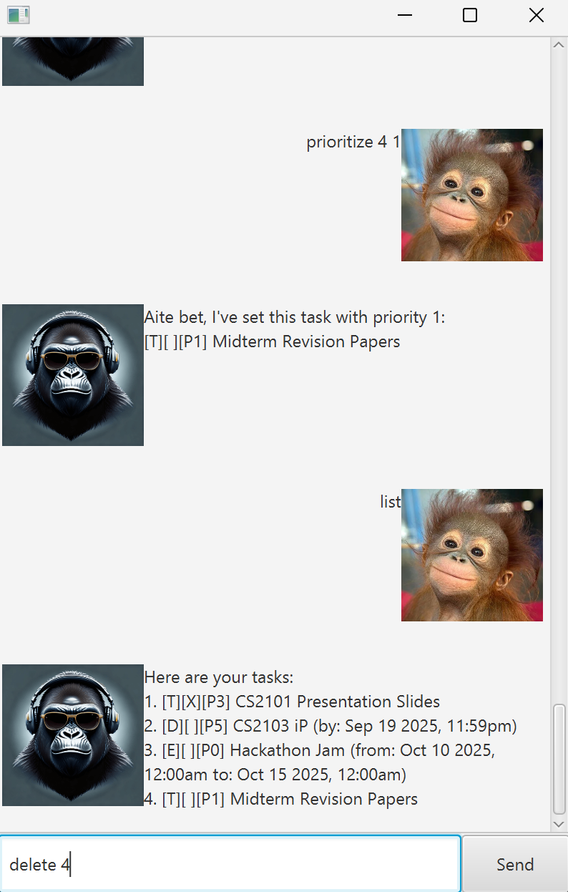

# Jamal User Guide




**Jamal** is a desktop chatbot that helps you manage your tasks efficiently. Whether you're planning a project, keeping up with deadlines, or just trying to stay organized, Jamal is here to help through a friendly, conversational interface.

## Quickstart

### Requirements
Java JDK **17**

### Download
Download the latest release [here](https://github.com/KH-boop-bit/ip/releases/tag/JAR-released).

### Run the Application
Copy the jar file into your desired folder. Then open terminal and cd into that folder. Run the following:
```bash
java -jar jamal.jar
```
You will be greeted with Jamal’s prompt where you can start typing commands. Type `help` to see list of commands.

Some example commands you can try:
- `todo homework`: Creates a todo task with the homework as the description
- `list`: Lists all tasks
- `delete 2`: Deletes the 2nd task in the current list
- `bye`: Exits the app

Refer to features below for more details of each command.

## Features

Jamal supports a rich set of commands to manage your tasks effectively. All commands should follow the specified formats.

---

### Task Listing 📋

#### List all tasks: `list`  
Lists **all tasks** in your task list.  

#### List all ongoing tasks: `list ongoing`  
Shows tasks that are currently in progress and not yet completed.  

#### List all overdue tasks: `list overdue`  
Displays tasks with deadlines or events that have already passed.  

#### List all upcoming tasks: `list upcoming`  
Lists tasks with upcoming deadlines or events in the future.  

---

### Search & Filter 🔍

#### Find task: `find <keyword>`  
Finds all tasks that contain the given keyword in their descriptions.   
**Example:**
- `find CS2101` finds all tasks that has CS2101 in the description
- `find hackathons` finds all tasks that has hackathons in the description
---

### Task Management 🛠️

#### Mark a task: `mark <tasknumber>`  
Marks the task at the specified line number as **done** in the current list.    
**Example:**
- `mark 1` marks the first task in the list
- `mark 3` unmarks the third task in the list

**Note:** 
- tasknumber **must be positive integer** 1, 2, 3...
- tasknumber **must fall within number of tasks**

#### Unmark a task: `unmark <tasknumber>`  
Marks the task at the specified line number as **not done**.  
**Example:**
- `unmark 1` unmarks the first task in the list
- `unmark 3` unmarks the third task in the list

**Note:**
- tasknumber **must be positive integer** 1, 2, 3...
- tasknumber **must fall within number of tasks**

#### Delete a task: `delete <tasknumber>`  
Deletes the task at the specified line number.  
**Example:**
- `delete 1` deletes the first task in the list
- `delete 3` deletes the third task in the list 

**Note:**
- tasknumber **must be positive integer** 1, 2, 3...
- tasknumber **must fall within number of tasks**

#### Prioritize a task: `prioritize <tasknumber> <priority>`  
Tags a priority level to the task at the given line number.     
**Example:**
- `prioritize 1 1` prioritizes the first task in the list with level 1
- `prioritize 3 5` prioritizes the third task in the list with level 5

**Note:**
- tasknumber **must be positive integer** 1, 2, 3...
- tasknumber **must fall within number of tasks**
- priority level **must be positive integer** 1, 2, 3...
- priority level **cannot exceed** 999
---

### Adding Tasks 📌

#### Add a Todo Task: `todo <description>`  
Adds a new ToDo task with the specified description.    
**Example:**
- `todo Homework for CS2100` adds a todo task for CS2100 homework
- `todo Design a chatbot for hackathon` adds a todo task for designing chatbot

**Note:**
- description **must not be empty** 

#### Add a Deadline Task: `deadline <description> /by <datetime>`  
Adds a Deadline task with a due date and time.  
**Example:**
- `deadline Homework for CS2101 /by 2025-10-10T23:59:59` adds a homework with deadline by 10 Oct 2025, 23:59pm
- `deadline tP for CS2103T /by 2025-11-11T12:00:00` adds a deadline for tP on 11 Nov 2025, 12pm

**Note:**
- description and datetime **must not be empty**
- `<datetime>` must follow this format: `YYYY-MM-DDTHH:MM:SS`

#### Add an Event Task: `event <description> /from <datetime> /to <datetime>`  
Adds an Event task with a specified time interval.  
**Example:**
- `event JPMorgan Hackathon /from 2025-10-11T12:00:00 /to 2025-10-14T12:00:00` adds a hackathon event from 11 Oct 2025, 12pm to 14 Oct 2025, 12pm
- `event 24k Lazada Marathon /from 2026-01-21T08:00:00 /to 2026-01-21T20:00:00` adds a marathon event from 01 Jan 2026, 8am to 01 Jan 2026, 8pm

**Note:**
- description and datetime **must not be empty**
- `<datetime>` must follow this format: `YYYY-MM-DDTHH:MM:SS`
---

### Exit & Help 📚

#### List available commands: `help`
Displays the full list of available commands.  

#### Exit the program: `bye`
Exits the program.

---

Do feel free to leave any questions or comments down [here](https://github.com/KH-boop-bit/ip)!